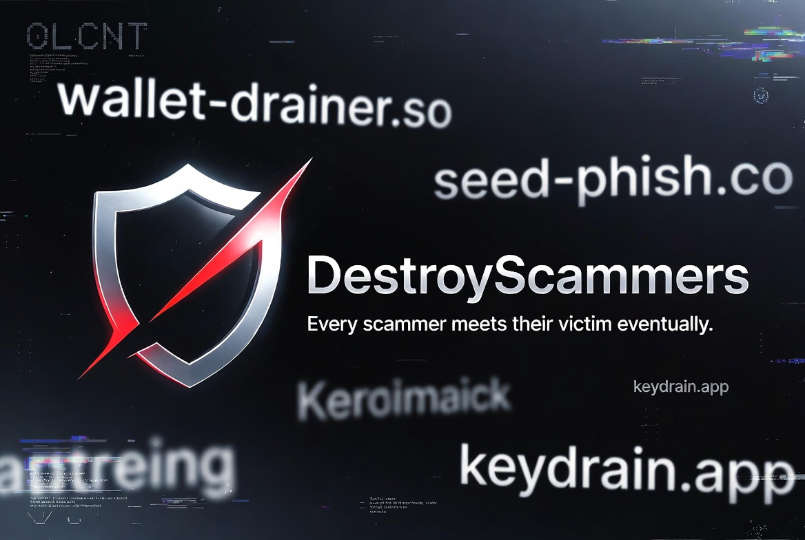

<div align="center">

#   DestroyScammers 

### Public Scam Intelligence Dashboard

<p>
  
  
  
  
</p>

**Scammers aren’t hackers — and this dashboard proves it.**

</div>

---

<!-- BANNER AFTER MAIN TITLE -->
<p align="center">
  
</p>

---


##   Important Notice

This dashboard — no, it's not a leak, no, these are not "random people."

These are my correspondents — it is important for you to understand that legally these people are not strangers to me, and each of the threats received an email from me at least once in the last few months with a request to stop their activity.

**Therefore, GDPR or anything similar does not apply here — thank you.**

My relationship with these users is at the level where I warned them about the public publication of their actions, and no claims will be considered by me.

---

## 🎯 The Reality About Scammers

[](https://git.io/typing-svg)

Well, let's talk about scammers and phishers. Sounds unpleasant, right?

If a victim hears that the scammer is from   , Belarus, or   — many hesitate to continue the investigation. But why?

<div align="center">

### 💀 Do you seriously think that scammers — who don't pay taxes — are needed by their country somehow?

### No, they are not.

</div>

It just so happened that I witnessed several cases — an airdrop drainer operated by actors from Russia, and the victims were from England, Australia, and the USA. All these cases were successful, and I decided to share this information with you.

<div align="center">

### 📢 My message is: **DO NOT STAY SILENT** if you were robbed
### Your silence is one of the reasons crime grows.

</div>

---

##   Who Are These Scammers?

Yes, relations between countries may be tense, but it's important to understand that **scammers are not the government**.

They are **frightened mice** — not real people — they are scared of their own shadow, scared of their own actions.

> **One of them even begged.**

It's important to gather evidence and identify your scammer. Once you have that, you can plan a solution.

---

## 📋 Real Cases I Witnessed
[](https://git.io/typing-svg)

| 🌍 Case | 📝 What Happened | ✅ Result |
|---------|------------------|-----------|
|   **Dubai** | Scammer flew to Dubai, where a case was already opened | **Detained at the airport. Situation resolved with victim's representatives.** |
| 🇰🇿 **Kazakhstan** | US citizen victim. Case transferred to Kazakhstan → Case opened → Request initiated to   Russia → Hacker arrested with search | **Victim got their money back. Scammer received NO protection.** |

<details>
<summary><b>📖 More details about the Kazakhstan case</b></summary>

<br>

I hope I can write this — the victim was a US citizen. I won't recommend any services or anything, especially my own — because I **do not provide any services**.

So, officially the victim transferred their case to a person in Kazakhstan — a case was opened, a request was initiated to Russia, and the hacker was arrested with a search. Russia also had questions for him, so there was no extradition to Kazakhstan.

We won't go into details — what matters is the essence:
- ✅ **The victim got their money back**
- ❌ **The scammer received no protection from his country — quite the opposite**

</details>
<details>
<summary><b>  More details about the Dubai case</b></summary>
Another case was resolved through Dubai — not because the scam happened there, but because the scammer eventually flew into the UAE, where the complaint had already been filed.

The victim was an older man who lost his entire savings after believing a “x2 airdrop” promoted under the name of a well-known media personality. The scammers walked him through every step in support chats, convincing him to send his full Coinbase balance and then the rest of his money from his bank account. For him, this was devastating — he genuinely believed in the promise, especially during a difficult period of his life.

He spent his final days worried that he would leave nothing to his grandchildren. He repeatedly visited his local police, talked about the mistake, and blamed himself for being “too naive”. For his son, the case became a matter of principle: the scammer had exploited a vulnerable person with precision and patience, and the loss was not only six-figures in crypto but also included funds tied to their home.

The digital trail pointed directly to Russia. The scammer slipped several times — including typing in the wrong keyboard layout — which helped confirm the identity.

At one point, the son even considered flying to Russia to file a report in person. But things changed when relatives monitoring the scammer’s social media noticed that he was traveling to Dubai.  
The son had a legal and stable residency-linked status in the UAE due to business connections, which allowed him to file a complaint directly through the UAE system.

He submitted the case, travelled to Dubai, and contacted local lawyers willing to handle a case involving a foreign national.

When the scammer landed in the UAE, the complaint was already active.  
That was enough:

- **The complaint was formally accepted in the UAE**
- **The scammer was detained upon arrival**
- **The case was processed under UAE jurisdiction**
- **His nationality and distance did not protect him**
</details>


<details>
<summary><b>  Russia Is Not Isolated — How Requests Really Get Processed/b></summary>

People often think that scamming victims from “unfriendly” countries is somehow safe. It isn’t.  
Crypto has no borders, and victims are not stupid — they can transfer their case to people in countries that actively cooperate with Russia. And there are many of these countries.

Russia is not North Korea, and even North Korea isn’t truly isolated. Russia has active legal cooperation with a long list of states, especially under the Minsk Convention and bilateral treaties.  
When a request comes from these countries, Russia processes it — searches, interrogations, asset freezes, and cross-border investigations happen regularly.

This includes:
Azerbaijan, Armenia, Belarus, Kazakhstan, Kyrgyzstan, Tajikistan, Turkmenistan, Uzbekistan — plus China, India, Türkiye, UAE, Iran, Vietnam, Mongolia, Argentina, Brazil, Cuba, Algeria, Egypt

Your passport doesn’t matter.  
A Russian tourist abroad can become a victim. A foreign victim can transfer their case to a country friendly to them. The stolen crypto can be tracked from anywhere.  
Jurisdiction follows the evidence — not your illusions.

Some scammers believe they live in an isolated bubble or that "local loyalty" protects them. That is a fantasy.  
International cooperation exists everywhere, and it hits harder than any local case.

But the most important part is this:

To trigger any international request, you must have an open case in your country.  
Without that, no cross-border action will ever start.

Do not pay “recovery scammers”. Do not rely on promises.  
Understand your case, collect evidence, and act quickly — time matters.  
A scammer can disappear, spend the funds, end up arrested for another crime, or simply vanish.

Most victims want their money back, not revenge.  
And the only real path to that is proper reporting, real evidence, and refusing to waste time on fake “helpers”.

</details>

---

## 💬 Message to Everyone

<div align="center">

### Please understand this: **do not forgive them** — talk about it.

</div>

Do not stay silent — speak up and report it.  
Scammers rely on victims being quiet, not on any real protection.

And for scammers: if you think your circles, chats, or “arbitration scenes” keep secrets — they don’t.  
People talk. Mistakes slip. Information leaks.  
Your own environment is often the first place where your identity surfaces.

---

##   The Moral of This Story

```
╔════════════════════════════════════════════════════════════════════════╗
║                                                                        ║
║   A scammer ends up in jail.                                           ║
║                                                                        ║
║   Robbing non-Russians is not "patriotism."                            ║
║                                                                        ║
║   You are useful to no one, and no one will protect you —              ║
║   not from an American citizen, not from anyone.                       ║
║                                                                        ║
║   These fat mice are easier to crush and hold accountable              ║
║   than they think.                                                     ║
║                                                                        ║
║   They don't pay taxes, they are parasites.                            ║
║                                                                        ║
║   You think you're "high-level"? No.                                   ║
║   State-sponsored ransomware groups (real APT operators)               ║
║   play in a completely different league.                               ║
║                                                                        ║
║   You are just thieves far below the level you pretend                 ║
║   to compare yourselves to.                                            ║
║                                                                        ║
║   And you think the country will protect a bunch of useless            ║
║   scammers? Let's see.                                                 ║
║                                                                        ║
╚════════════════════════════════════════════════════════════════════════╝
```

---

##   Tools Used

What tools did I use for the dashboard? Only **legal tools** paid for with my own money:

| Tool | Link | Purpose |
|------|------|----------|
| 🔎 **WHOXY** | https://www.whoxy.com/ | WHOIS intelligence, registrar data, domain history |
| 📷 **URLScan.io** | https://urlscan.io/ | Live scans, screenshots, DOM extraction, JS artifacts |
| 🗂️ **DestroyList Dataset** | https://github.com/phishdestroy/destroylist | Massive dataset of malicious domains & OSINT indicators |
| 🏛️ **WebArchive** | https://web.archive.org/ | Historical snapshots of scam/phishing sites |
| 🧬 **VirusTotal** | https://www.virustotal.com/ | Multi-engine URL/domain detection, passive DNS |
| 🕵️ **GHunt** | https://github.com/mxrch/GHunt | Google OSINT (Play Store, accounts, metadata leaks) |
| 🌐 **Censys** | https://search.censys.io/ | SSL certificates, IP-hosting correlations |
| 🔍 **Shodan** | https://www.shodan.io/ | Infrastructure fingerprinting, exposed services |
| 📡 **AbuseIPDB** | https://www.abuseipdb.com/ | IP reputation scoring |
| 📑 **Wayback Machine API** | https://archive.org/help/wayback_api.php | Automated archival lookups |

<details>
<summary><b>🏢 Registrar Reality</b></summary>


Some registrars occasionally reply to us on Twitter — for example, NameSilo, WebNIC, NiceNic and others — trying to imply that reports are “handled” and that they actively work with abuse teams.

The real picture is very different.

When a scammer-controlled domain gets reported once and banned, the same registrar continues to host:
- dozens of new domains,
- hundreds of already existing domains,
- all tied to the same malicious operator,
- all with identical phishing or drainer code.

If you inspect timestamps and account activity, it becomes clear:

**Registrars do not re-check the client, do not audit their accounts, and do not block the infrastructure — even after proven malicious activity.**

They simply process one report, remove one domain, and allow the scammer to continue operating freely.

In other words:

**They are not “fighting fraud”. They are part of the fraudster’s infrastructure.**
</details>

---

##   Roadmap

I may add more scammers, more information, more functions — but it turned out to be harder than I expected and took a lot of time.

I also want to make a tool (it already exists privately) for collecting evidence — to show you how phishing sites or popular drainers expose the scammer's data and various information that helps identify them.

### Planned Content:

| # | Topic | Description |
|---|-------|-------------|
|   | **Domain Attribution** | How simple it is to identify the mice through domains *(this dashboard)* |
|   | **Evidence Collection** | Through code, web archives, and scans when banning phishing sites |
|   | **Financial Tracing** | How bridges, exchanges, and mixers can be identified and funds traced |

---

##   Message for Victims

<table>
<tr>
<td width="50%">

###   DO NOT

- **Stay silent** about theft
- **Trust "recovery scammers"**
- **Pay for "getting your money back"** — they are lying
- **Believe anyone who gives "guarantees"** — they are liars

</td>
<td width="50%">

###   DO

- **Report it**
- **Save everything** (URLs, screenshots, logs, transactions)
- **Think carefully**
- **Consider many factors**
- **Don't rush**

</td>
</tr>
</table>

---

##   Choosing Legal Representation

The Kazakhstan case was chosen not randomly — you should remember:

>   **Choosing lawyers from Russia is a bad idea for international theft cases.**
>
> They can scam you again. It is better if the legal process happens in a country **friendly to yours** — otherwise the funds can simply be returned and then stolen again.

Think carefully. Understand the situation. Do not rush — you must consider many factors.

---

##   The Truth About "Protected" Scammers

<div align="center">

### There are no "government-backed low-level scammers" in Russia.

</div>

- Connections scammers brag about **do not matter internationally**
- If there is strong direct evidence — **they will not show up to protect the scammer**
- At best, scammers know some low-level policeman who once got kickbacks from a stupid fraudster
- But even that cop is dealing with drug cases, not helping cybercriminals

---

##   Scammers vs Real Cybercriminals

I have never seen or heard of scammers being defended like Locker-level cases.

**Those are different worlds.**

| Low-Level Scammers                              | State-Sponsored Ransomware / APT Operators               |
|-------------------------------------------------|-----------------------------------------------------------|
| Worthless to the country                        | Operate at government or intelligence-service level      |
| Receive no protection                           | Backed by geopolitical interests and classified mandates |
| Easy to identify and prosecute                  | Subject to entirely different legal and political rules  |
| Just opportunistic thieves                      | Not about petty theft — strategic, high-impact missions  |


<details>
<summary><b>🗂️ Why We Publicly Archive Scam Infrastructure</b></summary>

For years scammers never understood why their phishing domains, drainers,
panels and payloads were constantly:

• scanned publicly,  
• archived in WebArchive,  
• indexed in URLScan,  
• mirrored, fingerprinted, timestamped,  
• and stored in long-term passive datasets.

They assumed it was for “pretty reports” or community posts.

Here is the real answer.

We spent the last 5 years **passively collecting high-value forensic
evidence** — not for entertainment, not for social media, but so scammers
could finally understand what they never learned:

**Every domain, every redirect, every script, every panel, every update,
every operational mistake becomes a permanent artifact.**

And once it is archived publicly, **you cannot erase it**.

This was never about beauty of reporting.  
A report can be perfect or messy — the outcome is the same.

There are registrars who follow the law strictly and act immediately.  
And there are others where no “format”, no “style”, no “correct wording”
matters — because the evidence alone is enough.

**We did not collect data for style.  
We collected it so scammers could understand their position —  
your infrastructure has been documented for years,  
and nothing you do now can change that.**
</details>

<div align="center">

### Scammers are worthless to the country.
### Especially when they stand against law enforcement.

</div>

---

##   Final Words

So gather evidence. Save everything.

And hopefully the scammer won't have time to waste the stolen money or lose it in a casino.

---
<details>
<summary><b>🔥 Personal Motivation & Interest</b></summary>

<br>

People often try to question my personal interest in this project, as if
proving I have motivation somehow changes their responsibility for the
crimes they committed. It does not.

My interest is not in your personality. I do not care who you are or what
you think you are. My interest is in the cases: the infrastructure, the
techniques, the mistakes, the patterns, the phishing kits, the drainers,
and the operational footprint you leave behind.

As long as you operate in the background, you are just another dataset to
analyze. But if a scammer decides to attack me directly, they become my
interest by their own choice. Crossing that line changes everything—not
because I chase anyone, but because they voluntarily place themselves in
that position.

At that point, all I can say is this: whatever you believe in may help you,
because your actions certainly will not.
</details>

---

<details>
<summary><b>🧨 A Note for Scammers Who Think They Outsmarted the System</b></summary>
Many Russian scammers invented a comforting myth: “if you don’t touch the stolen money for five years, you can legalize it later and walk away clean.” Reality is different. If an investigation is active or you appear in an open case, the clock does not run for you. And your crimes are never “just money theft” — they involve unauthorized access, personal data breaches, fraud, crypto laundering, cross-border transfers, and conspiracy. Each of these separately resets or extends statute limits. The “five-year legend” is nothing more than self-soothing fiction. If you’re already in the pipeline, waiting won’t save you.
</details>

<div align="center">

###   Links

[](https://github.com/DestroyScammers)
[](https://github.com/phishdestroy/destroylist)

---

**🔥 Exposing scammers. Helping victims. One domain at a time.**


</div>
